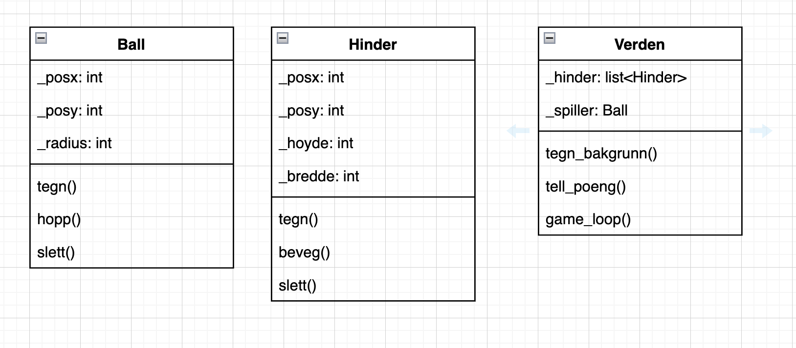
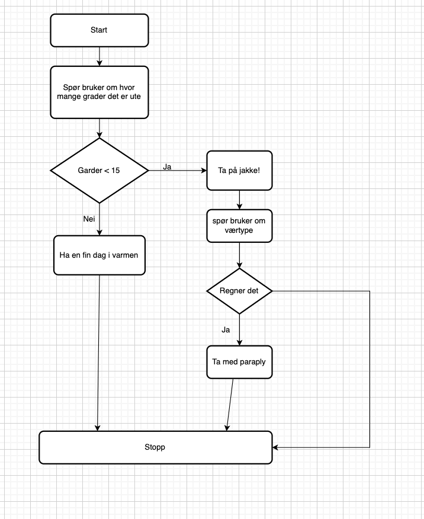
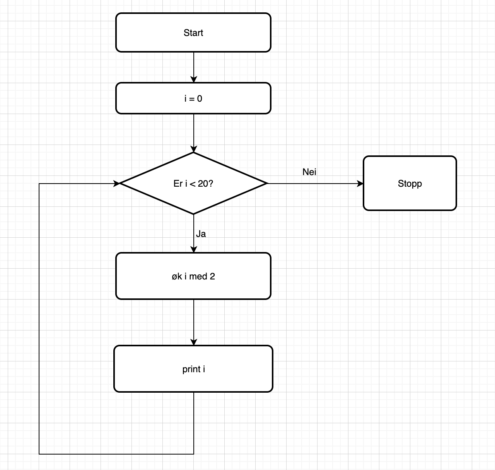

# Objektorienter modeller som beskriver programstruktur

## UML - diagram
UML diagrammer brukes når man skal lage større eller mindre prosjekter med objektorineter programmering. ET UML diagram er en  oversikt over klassene programmene skal ha og hvilke metoder og egenskaper klasssene skal ha. 

## Flyt skjema
Flyt skjema er et verktøy som brukes for å planlegge programmer. Det gjør det lettere å vite hva man ønske å få som utput av ulike tilfeller i programmet.

[flyt.vaer.py](flyt-vaer.py)

[flyt.while.py](flyt.while.py)
